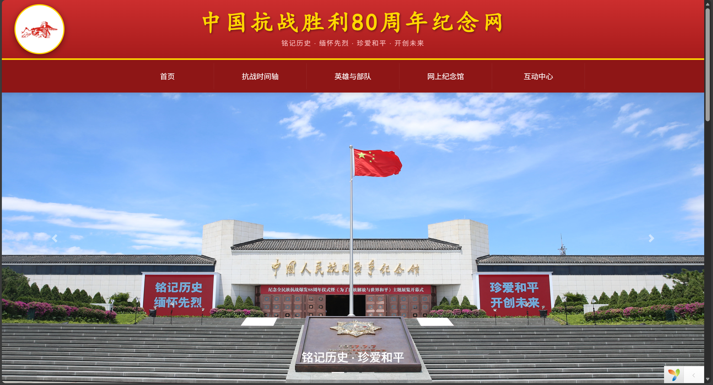
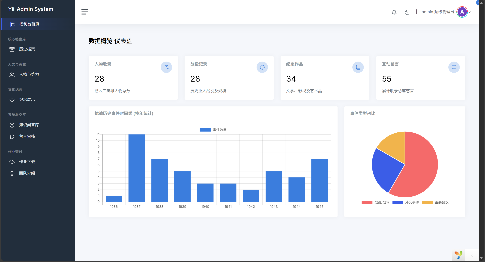
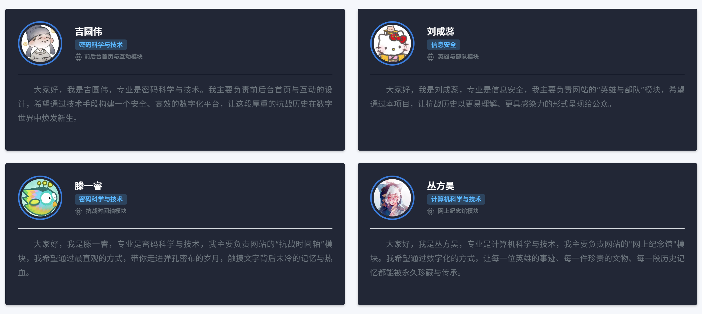

<p align="center">
    <a href="https://github.com/yiisoft" target="_blank">
        
    </a>
    <h1 align="center">Yii 2 Advanced Project —— 纪念中国人民抗日战争胜利80周年网站 </h1>
    <br>
本项目为 2025 年秋季南开大学计算机学院与网络空间安全学院《互联网数据库开发》课程设计 。项目由**“方圆双睿”**团队在乜鹏老师的指导下完成，旨在通过数字化手段纪念中国人民抗日战争暨世界反法西斯战争胜利 80 周年 。

**本项目基于 Yii 2 Advanced 应用模板开发**，采用前端、后端及控制台分离的架构，适用于构建复杂的 Web 应用。

## 项目背景与立意

2025 年是抗日战争胜利 80 周年的重大历史节点 。本项目旨在利用 Web 技术突破传统实体纪念馆在物理空间、开放时间与地理位置上的限制，构建一个受众范围广、互动性强的“数字化展示系统” 。力求达到以下目标：

- **铭记历史**：系统整理抗战时期的重大战役、英雄人物及外交事件，保留重要史料资源 。
- **时代价值**：响应国家关于“将红色传统利用好、发扬好、传承好”的号召，增强青年一代的历史认知与文化自信 。
- **数字赋能**：利用结构化数据和多媒体资源，将静态展示转化为多维信息空间，提升历史教育的直观性和沉浸感 。

---

## 目录概览 

- `backend/`：后台管理应用（控制器、视图、配置等）
- `frontend/`：对外网站应用
- `common/`：前后端共享代码（模型、配置等）
- `console/`：控制台命令与迁移
- `data/install.sql`：数据库文件以及团队与个人开发文档


### 主要项目结构

```
+---backend
|   +---assets
|   +---config
|   +---controllers
|   +---models
|   +---runtime
|   +---tests
|   +---views
|   |   +---battle-events
|   |   +---characters
|   |   +---diplomatic-events
|   |   +---events
|   |   +---forces
|   |   +---layouts
|   |   +---locations
|   |   +---meeting-events
|   |   +---mem-activities
|   |   +---mem-works
|   |   +---messages
|   |   +---question
|   |   +---site
|   |   +---teams
|   \---web
+---common
|   +---config
|   +---fixtures
|   +---mail
|   +---models
|   |   \---search
|   +---tests
+---console
+---data
|   +---personal
|   +---team
|    install.sql
+---environments
+---frontend
|   +---assets
|   +---config
|   +---controllers
|   +---models
|   +---runtime
|   +---tests
|   +---views
|   |   +---character
|   |   +---event
|   |   +---Interactive
|   |   +---layouts
|   |   +---mem
|   |   +---site
|   \---web
+---vagrant
```

#### 部署步骤

请参考`data/team/方圆双睿_部署文档(2311786_2312478_2310682_2313109).pdf`文档，页面效果：

前端：



后端：



#### 贡献与联系

欢迎提交 Issue / Pull Request。若需帮助，请在仓库中创建 Issue 并附上错误日志与重现步骤，联系邮箱：`1819365448@qq.com`


## 团队与致谢

- **所属单位**：南开大学 计算机学院和网络空间安全学院 
- **指导教师**：乜鹏 
- **开发团队**：方圆双睿
- **团队成员**：


